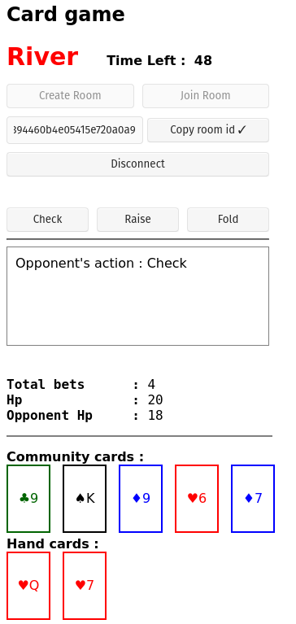

#### Simple javascript card game client for demonstration

Card game server : [Server](https://github.com/simhyeon/cardserver)

#### Game's rule

This game is based on texas hold'em poker rules.

There are community cards that are shown to both players and hand cards that is unique to the player.

Player can combine both community cards and hand cards to make specific combination.

Combination is same with that of normal poker's. e.g straight, flush, three of a kind etc.

If player wins then apply damage to opponent by amount of total bet played on current round.

Player can check, fold, raise or call to opponent's raise in every turn.

Check doesn't add bets while raise does by 1.

#### How game works

Create button and join button creates websocket connection between server and receives server response or error if something went wrong.

Players can play bets on every turn and proceeds to next turn if both players have bet or time limit passes.

On shodown, player get bet result and parse server reponse to update current status.

If player's hp goes lower than 0, then player loses and vice versa.

#### Image

